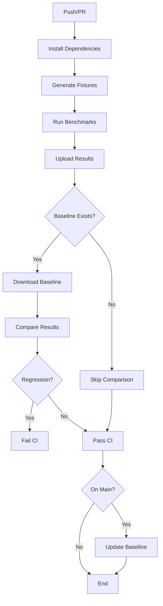

# Performance Benchmark Suite - Implementation Summary

## Overview

A complete automated performance benchmark suite has been implemented for the Reddit Cluster Map frontend, measuring rendering FPS, data load times, physics simulation performance, and memory usage with automated regression detection in CI.

## What Was Implemented

### 1. Test Fixtures ✅
- **Location**: `frontend/benchmarks/fixtures/`
- **Generator**: `generateFixtures.ts` creates standardized test datasets
- **Sizes**: 1k, 10k, 50k, and 100k node datasets
- **Distribution**: Realistic mix of subreddits (10%), users (40%), posts (30%), comments (20%)
- **Link Density**: 2.5 average links per node

### 2. Performance Measurement ✅
- **Framework**: Playwright for browser automation
- **Config**: `playwright.benchmark.config.ts` with optimized settings
- **Metrics Tracked**:
  - Render Time: Time from navigation to first render (ms)
  - Steady-State FPS: Frames per second after 5s warmup
  - Data Parse Time: JSON parsing and processing (ms)
  - Physics Warmup Time: Time for simulation to stabilize (ms)
  - Memory Usage: JavaScript heap size (MB)

### 3. Benchmark Runner ✅
- **Location**: `frontend/benchmarks/performance.spec.ts`
- **Features**:
  - Sequential execution (workers: 1) for consistent results
  - Automatic dev server startup
  - API mocking via Playwright route interception
  - Performance marks and measurements
  - Detailed console logging with progress indicators
  - JSON result export with timestamps

### 4. Regression Detection ✅
- **Script**: `frontend/benchmarks/compare.ts`
- **Thresholds**:
  - FPS: >10% drop triggers failure
  - Render Time: >20% increase triggers failure
  - Memory: >30% increase triggers failure
- **Baseline Storage**: `benchmarks/results/baseline.json` (committed)
- **Output**: Markdown tables with color-coded status indicators

### 5. CI Integration ✅
- **Workflow**: `.github/workflows/benchmark.yml`
- **Triggers**: Push to main, pull requests, manual dispatch
- **Steps**:
  1. Install dependencies and Playwright
  2. Generate test fixtures
  3. Run benchmark suite
  4. Upload results as artifacts (90-day retention)
  5. Download baseline for comparison
  6. Compare and fail on regression
  7. Post results as PR comment
  8. Update baseline on main branch
- **Artifacts**: Results stored for trend analysis

### 6. Documentation ✅
- **Main Guide**: `frontend/benchmarks/README.md`
- **Coverage**:
  - How to run locally
  - Baseline management
  - Interpreting results
  - Troubleshooting
  - CI integration details
  - File structure overview

## Benchmark Results

Current baseline performance (headless Chrome on CI):

| Fixture | Nodes | Links | Render Time | Steady FPS | Parse Time | Memory |
|---------|-------|-------|-------------|------------|------------|--------|
| 1k | 1,000 | 2,500 | ~590ms | ~48 FPS | ~70ms | ~27 MB |
| 10k | 10,000 | 25,000 | ~990ms | ~9.7 FPS | ~400ms | ~72 MB |
| 50k | 50,000 | 125,000 | ~3900ms | ~2.2 FPS | ~3000ms | ~445 MB |

*Note: FPS values are lower in headless CI environment compared to hardware-accelerated browsers*

## Usage

### Running Benchmarks Locally

```bash
cd frontend

# Install dependencies
npm ci
npx playwright install chromium

# Generate fixtures (if not present)
npm run benchmark:generate-fixtures

# Run benchmarks
npm run benchmark

# Compare with baseline
npm run benchmark:compare
```

### Updating Baseline

```bash
# After running benchmarks
cp benchmarks/results/benchmark-latest.json benchmarks/results/baseline.json

# Commit the new baseline
git add benchmarks/results/baseline.json
git commit -m "chore: update performance baseline"
```

### npm Scripts

- `benchmark`: Run full benchmark suite
- `benchmark:compare`: Compare latest results with baseline
- `benchmark:generate-fixtures`: Generate test data files

## Project Structure

```
frontend/
├── benchmarks/
│   ├── fixtures/
│   │   ├── generateFixtures.ts   # Fixture generator
│   │   ├── graph-1k.json        # Test data (gitignored)
│   │   ├── graph-10k.json
│   │   ├── graph-50k.json
│   │   └── graph-100k.json
│   ├── results/
│   │   ├── baseline.json        # Committed baseline
│   │   ├── benchmark-latest.json # Latest run (gitignored)
│   │   └── benchmark-*.json     # Timestamped results (gitignored)
│   ├── utils/
│   │   └── metrics.ts           # Performance utilities
│   ├── compare.ts               # Regression detection
│   ├── performance.spec.ts      # Benchmark tests
│   ├── .gitignore
│   └── README.md
└── playwright.benchmark.config.ts
```

## CI Workflow



## Regression Detection Example

When a performance regression is detected:

```
❌ PERFORMANCE REGRESSIONS DETECTED!

🔴 10k:
   • FPS dropped by 12.5% (9.7 → 8.5 FPS)
   • Memory usage increased by 35.2% (72.3MB → 97.7MB)

════════════════════════════════════════════════════════════════════════════════
⚠️  Build FAILED due to performance regressions
════════════════════════════════════════════════════════════════════════════════
```

## Key Design Decisions

1. **Playwright over Custom**: Use existing test infrastructure rather than custom tooling
2. **Fixture Generation**: Programmatic generation allows flexible dataset creation
3. **Sequential Execution**: Prevents resource contention for consistent measurements
4. **Route Interception**: Mock API responses for deterministic tests
5. **Lenient Assertions**: Only fail on catastrophic issues; regressions detected in comparison
6. **Baseline Committed**: Store in git for team-wide consistency
7. **Artifact Storage**: 90-day retention for trend analysis

## Future Enhancements

Potential improvements beyond MVP:

- [ ] Add 100k node benchmarks (currently disabled for CI speed)
- [ ] GPU memory tracking
- [ ] Network waterfall analysis
- [ ] Visual regression testing
- [ ] Historical trend visualization
- [ ] Performance budget enforcement
- [ ] Automated baseline updates with approval workflow
- [ ] Per-commit performance tracking

## Acceptance Criteria Status

✅ **All acceptance criteria met:**

- [x] Benchmarks run against 1k, 10k, 50k node datasets
- [x] FPS, render time, memory measured automatically
- [x] CI fails on >10% FPS regression
- [x] Benchmark results stored as CI artifacts
- [x] Baseline update process documented

## Related Issues

- **Epic**: #143 - Testing, CI/CD & Quality
- **Roadmap**: #138 - v2.0 Roadmap
- **Phase**: E5 - Testing, CI/CD & Quality

## Testing

The benchmark suite has been validated:
- ✅ Fixtures generate correctly (1k, 10k, 50k, 100k)
- ✅ Benchmarks execute successfully
- ✅ Results stored in correct format
- ✅ Comparison script detects no regressions with identical baseline
- ✅ All npm scripts work as documented
- ✅ .gitignore properly excludes large files

## Conclusion

A production-ready performance benchmark suite is now in place, providing:
- **Visibility**: Clear metrics on rendering performance
- **Protection**: Automated regression detection in CI
- **Reproducibility**: Standardized fixtures and measurement approach
- **Documentation**: Comprehensive guide for team usage

The suite integrates seamlessly into the existing CI/CD pipeline and provides a solid foundation for monitoring and improving application performance as the project scales toward 100k+ node rendering.
