# System Architecture

This document provides a comprehensive overview of the Reddit Cluster Map architecture, including component interactions, data flow, and design decisions.

## Table of Contents

- [High-Level Architecture](#high-level-architecture)
- [Component Diagram](#component-diagram)
- [Data Flow](#data-flow)
- [Database Schema](#database-schema)
- [API Architecture](#api-architecture)
- [Graph Generation Pipeline](#graph-generation-pipeline)
- [Deployment Architecture](#deployment-architecture)

## High-Level Architecture

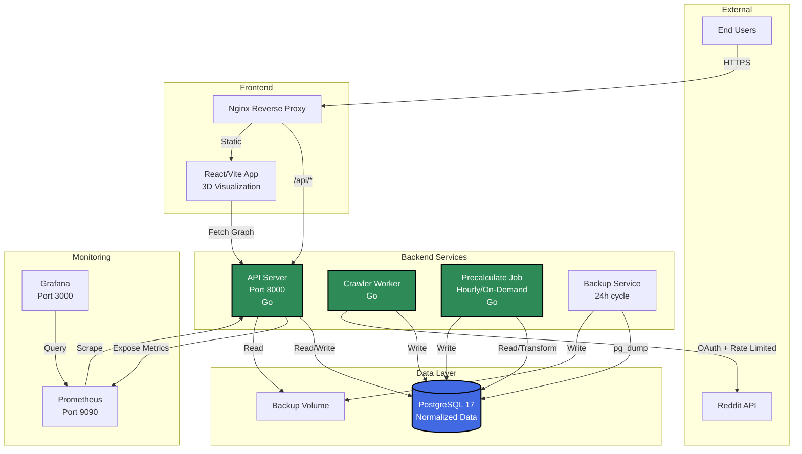

## Component Diagram

### Backend Components

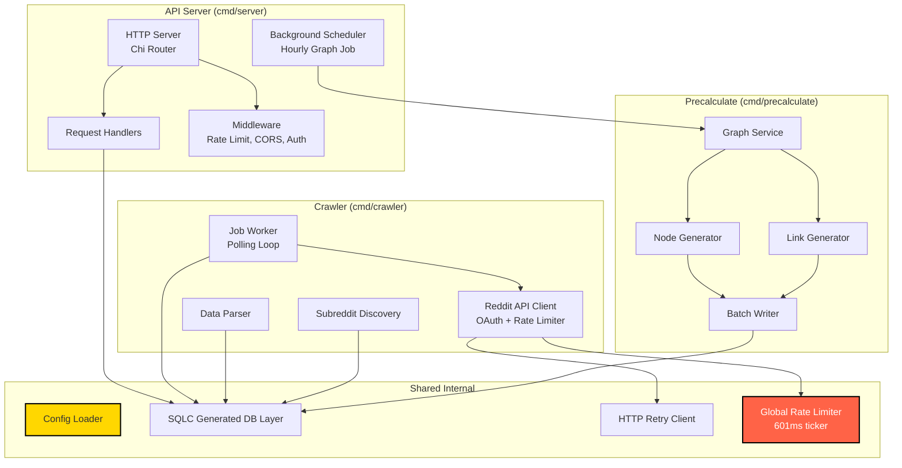

### Frontend Architecture

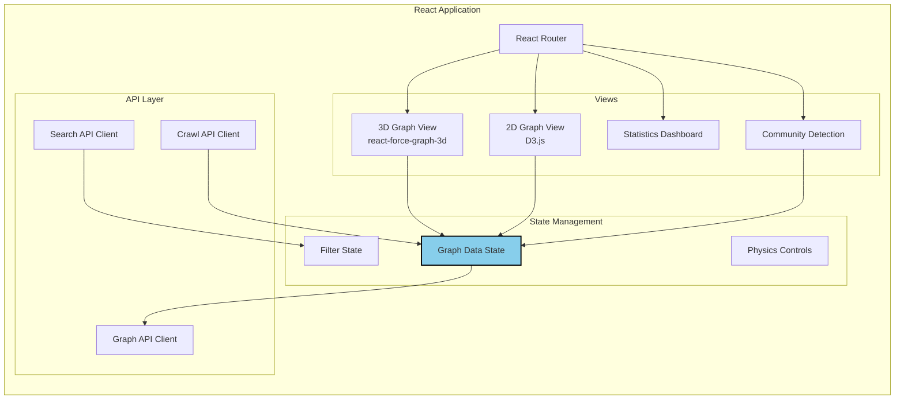

## Data Flow

### Crawl Flow

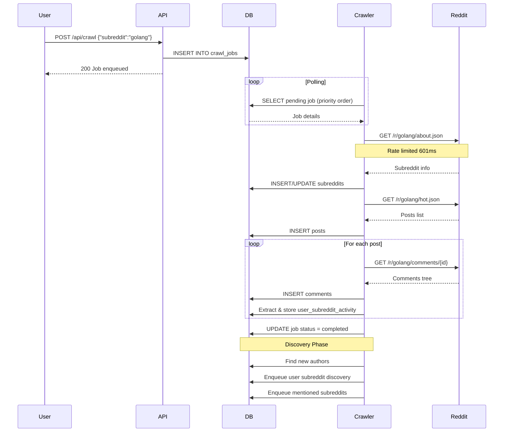

### Graph Generation Flow

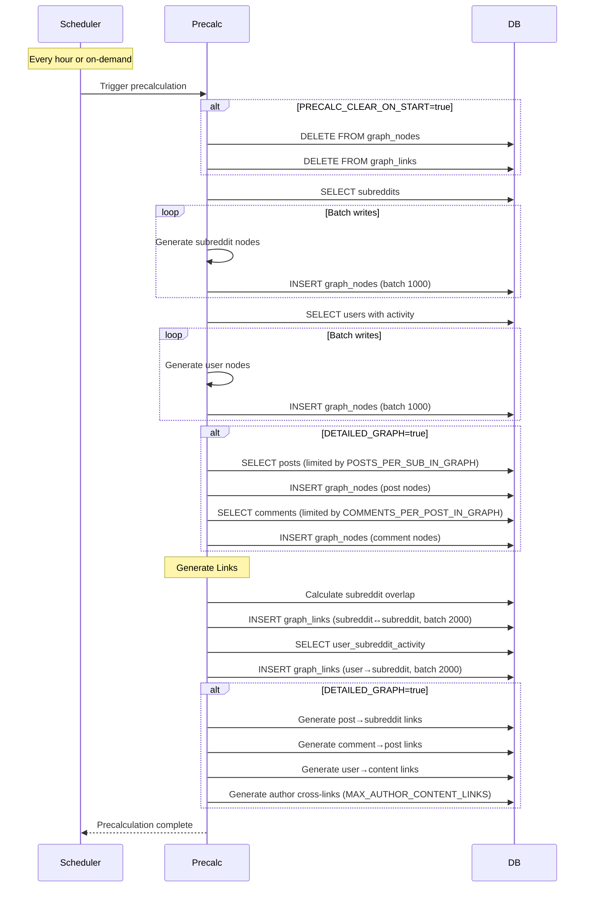

### API Request Flow

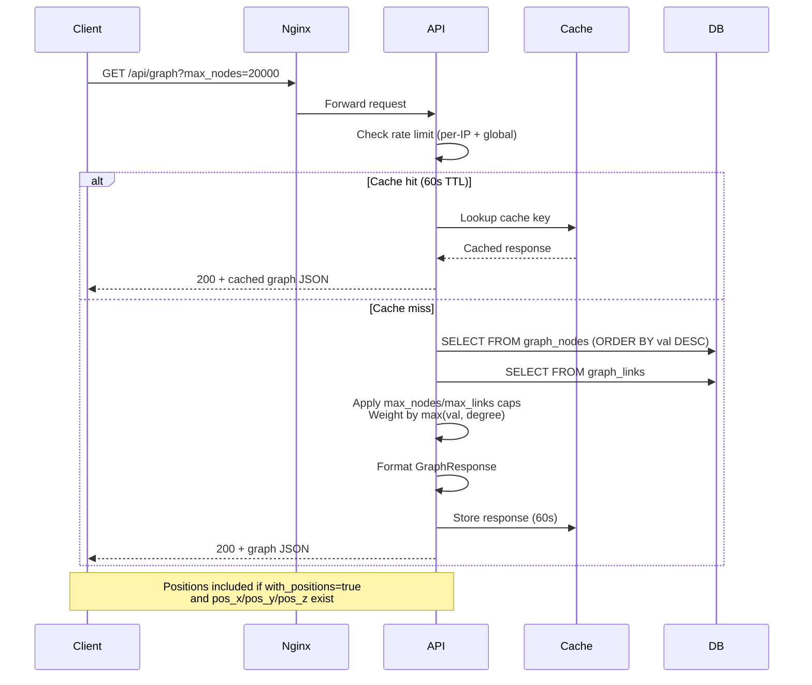

## Database Schema

### Core Tables

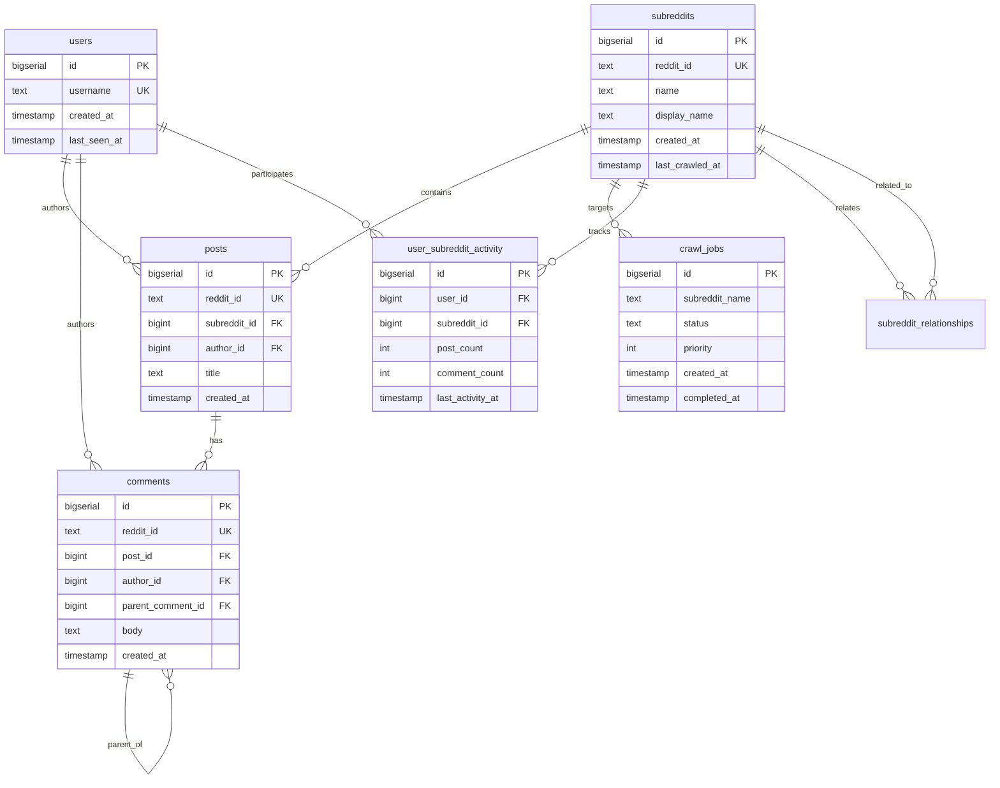

### Graph Tables

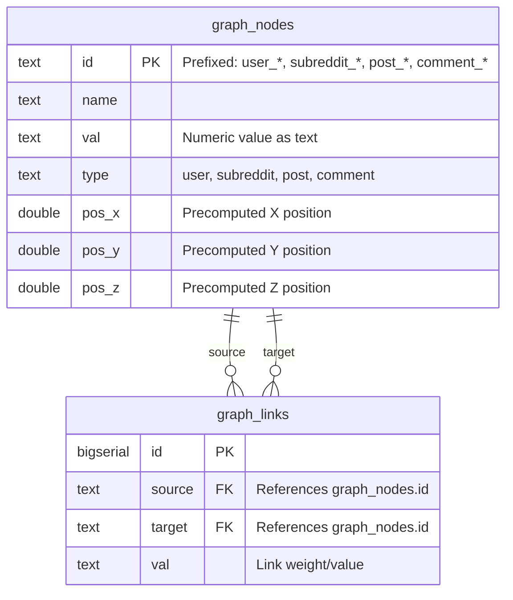

### Indexes

Key indexes for performance:

```sql
-- Crawl job processing
CREATE INDEX idx_crawl_jobs_status_priority 
ON crawl_jobs(status, priority DESC, created_at);

-- Graph queries
CREATE INDEX idx_graph_nodes_type ON graph_nodes(type);
CREATE INDEX idx_graph_nodes_val ON graph_nodes(val DESC);
CREATE INDEX idx_graph_links_source ON graph_links(source);
CREATE INDEX idx_graph_links_target ON graph_links(target);

-- User activity lookups
CREATE INDEX idx_user_subreddit_activity_user 
ON user_subreddit_activity(user_id);
CREATE INDEX idx_user_subreddit_activity_subreddit 
ON user_subreddit_activity(subreddit_id);

-- Content relationships
CREATE INDEX idx_posts_subreddit ON posts(subreddit_id);
CREATE INDEX idx_comments_post ON comments(post_id);
CREATE INDEX idx_comments_parent ON comments(parent_comment_id);
```

## API Architecture

### Request Processing Pipeline

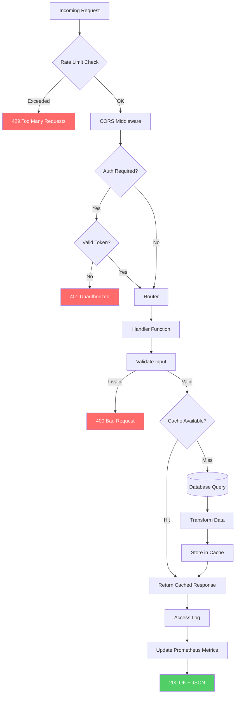

### Endpoint Categories

**Public Endpoints:**
- `GET /health` - Health check
- `GET /metrics` - Prometheus metrics
- `GET /api/graph` - Graph data (cached)
- `GET /api/communities` - Community supernodes
- `GET /api/communities/{id}` - Community subgraph
- `GET /api/search` - Search nodes
- `GET /api/export` - Export graph data

**Resource Endpoints:**
- `GET /subreddits` - List subreddits
- `GET /users` - List users
- `GET /posts` - List posts
- `GET /comments` - List comments
- `GET /jobs` - List crawl jobs

**Admin Endpoints** (require `ADMIN_API_TOKEN`):
- `POST /api/crawl` - Enqueue crawl job
- `POST /admin/*` - Administrative operations

## Graph Generation Pipeline

### Node Generation Strategy

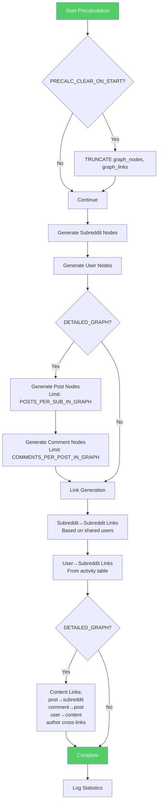

### Batch Processing

Precalculation uses batching to optimize performance:

1. **Node batches** (`GRAPH_NODE_BATCH_SIZE=1000`)
   - Collects nodes in memory
   - Bulk INSERT every 1000 nodes
   - Reduces database round-trips

2. **Link batches** (`GRAPH_LINK_BATCH_SIZE=2000`)
   - Larger batches for links (simpler data)
   - Bulk INSERT every 2000 links

3. **Progress logging** (`GRAPH_PROGRESS_INTERVAL=10000`)
   - Logs progress every 10,000 items
   - Helps monitor long-running precalculations

### Node ID Prefixing

All graph nodes use prefixed IDs for type safety:

- `subreddit_123` - Subreddit with database ID 123
- `user_456` - User with database ID 456
- `post_789` - Post with database ID 789
- `comment_101` - Comment with database ID 101

This prevents ID collisions and enables type identification without additional queries.

## Deployment Architecture

### Docker Compose Stack

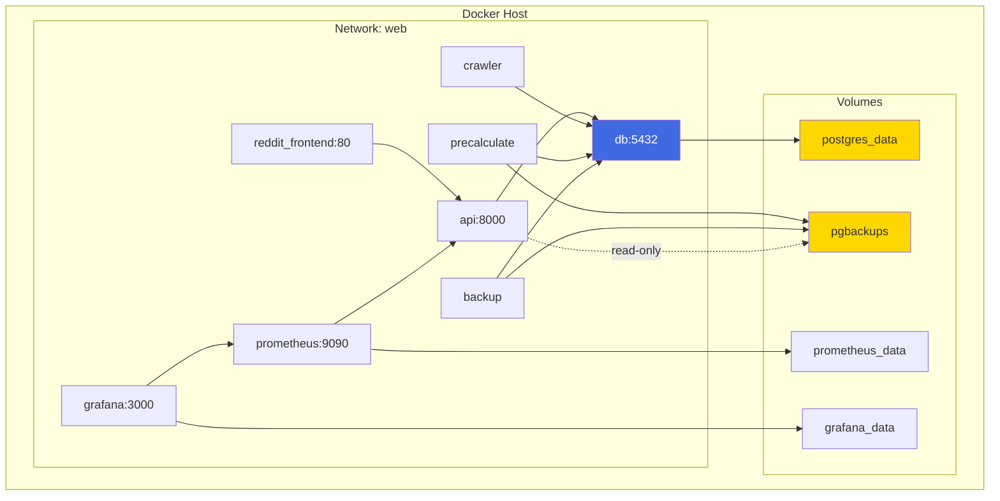

### Production Considerations

**Reverse Proxy Setup:**
```
Internet → Nginx/Traefik → Docker Network → Services
```

Typical nginx configuration:
```nginx
location /api/ {
    proxy_pass http://api:8000/api/;
    proxy_set_header X-Real-IP $remote_addr;
    proxy_set_header X-Forwarded-For $proxy_add_x_forwarded_for;
}

location / {
    proxy_pass http://reddit_frontend:80/;
}
```

**Scaling Considerations:**

1. **Read Replicas**: Use PostgreSQL replication for read-heavy workloads
2. **Multiple Crawlers**: Scale horizontally with multiple crawler instances (they coordinate via database)
3. **CDN**: Serve static frontend assets via CDN
4. **Redis Cache**: Replace in-memory cache with Redis for multi-instance API deployments

**Security:**

- All services communicate on internal Docker network
- Only necessary ports exposed to host
- API rate limiting protects against abuse
- CORS configured to restrict origins
- Admin endpoints require bearer token authentication

## Design Decisions

### Why PostgreSQL?

- **Relational data**: Natural fit for Reddit's hierarchical data (subreddits → posts → comments)
- **ACID compliance**: Data integrity for crawl jobs and graph consistency
- **JSON support**: Flexible for storing Reddit API responses if needed
- **Performance**: Excellent query optimization with proper indexes
- **Replication**: Built-in support for read replicas

### Why Precalculated Graph?

- **Performance**: On-demand graph generation is too slow for interactive use
- **Caching**: Precomputed graph can be cached and served quickly
- **Consistency**: Hourly refresh provides stable, predictable data
- **Optimization**: Allows batch operations and optimized queries

### Why Global Rate Limiting?

- **Reddit API limits**: Respecting Reddit's rate limits prevents bans
- **Simplicity**: Single global ticker is easier to reason about than distributed limiting
- **Sufficient**: 1.66 rps is adequate for asynchronous crawling
- **Safe**: Prevents accidental rate limit violations

### Why sqlc?

- **Type safety**: Generated code provides compile-time safety
- **Performance**: No reflection overhead, direct SQL
- **Maintainability**: SQL stays in SQL files, easy to review and optimize
- **Testing**: Simple to mock generated interfaces

### Why Hourly Precalculation?

- **Balance**: Frequent enough for freshness, infrequent enough to not overload database
- **Predictable**: Scheduled jobs are easier to monitor and debug
- **Resource-friendly**: Allows crawler to work without competing for database resources
- **Flexible**: Can trigger on-demand when needed

## Monitoring Architecture

### Metrics Flow

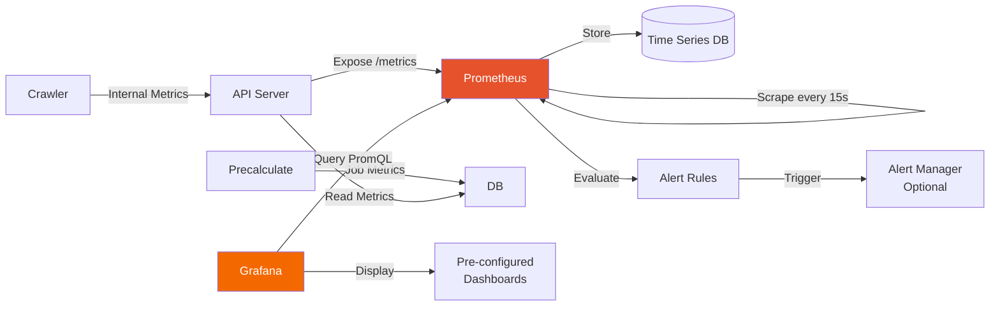

### Key Metrics Collected

**API Metrics:**
- `http_requests_total{endpoint, method, status}` - Request count
- `http_request_duration_seconds{endpoint}` - Request latency histogram
- `api_graph_cache_hits_total` - Cache hit rate
- `api_rate_limit_exceeded_total{type}` - Rate limit violations

**Crawler Metrics:**
- `crawler_jobs_processed_total{status}` - Job completion count
- `crawler_posts_scraped_total` - Posts collected
- `crawler_comments_scraped_total` - Comments collected
- `crawler_reddit_api_calls_total{endpoint}` - Reddit API usage

**Graph Metrics:**
- `graph_nodes_total{type}` - Node counts by type
- `graph_links_total` - Total link count
- `graph_precalc_duration_seconds` - Precalculation time

**Database Metrics:**
- `db_operation_duration_seconds{operation}` - Query performance
- `db_errors_total{operation}` - Database error rate

See [docs/monitoring.md](./monitoring.md) for complete metrics reference and example queries.
